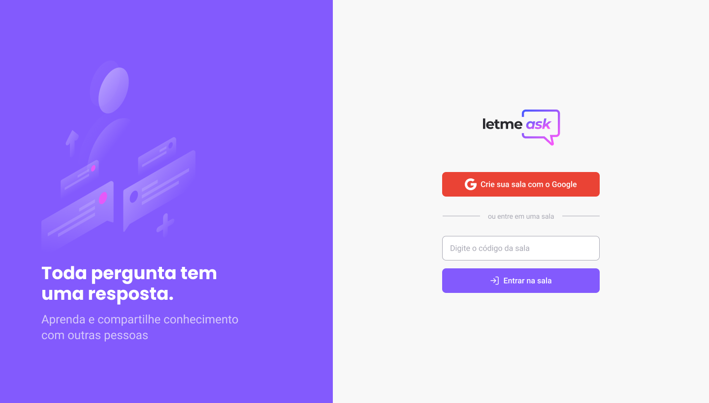

## Menu

[Sobre o projeto](#book-sobre-o-projeto)

[Funcionalidades](#pencil-funcionalidades)

[Tecnologias](#rocket-tecnologias)

[Preview](#eyes-preview)

[Layout](#art-layout)

[Como contribuir](#gear-como-contribuir)

[Contato](#mailbox-contato)

[Siga-me ](#siga-me)

<br>

# :book: Sobre o projeto
Essa aplicação é um recurso para agrupar as perguntas mais frequentes feitas por usuários feitas a hosts de lives/reuniões/eventos 
Esse projeto foi desenvolvido durante a 6ª edição [Next Level Week - Mission: ReactJS](https://app.rocketseat.com.br/nlw-together/tracks) - oferecido por [Rocketseat](https://www.rocketseat.com.br)<br />
<h4 align='center'> :construction: In development :construction:</h4>
O mesmo é um dashboard das vendas de uma loja

---

# :pencil: Funcionalidades

---

# :rocket: Tecnologias
Este projeto foi desenvolvido com as seguintes tecnologias:
## Frontend Web
- [ReactJS](https://pt-br.reactjs.org)
- [Typescript](typescriptlang.org/)
- [Firebase](https://firebase.google.com/?hl=pt)
- [Styled Components](https://styled-components.com)
- [React Router Dom](https://reactrouter.com/web/guides/quick-start)


---

# :eyes: Preview
## Visualização do adm
<div>
   
   
   
   
   
</div>

## Visualização do parcipante
<div>
   
   
   
</div>


---

# :art: Layout
The Layout was developed by [Rebecca Gonzalez](https://www.linkedin.com/in/gonzalezrebecca/), and you can access it on [Figma](https://www.figma.com/community/file/1009824839797878169)

---

# :fire: Como usar
## :white_flag: Condições prévias
Você precisa ter instalado:

- NodeJS
- JAVA 11
- Package manager (NPM ou Yarn)

## 💾 Clone esse repositório

```bash
$ git clone https://github.com/ojeffpinheiro01/let-me-ask.git
```

## 📁 Entre na pasta

```bash
$ cd let-me-ask
```

## 🔧 Instale as dependências

```bash
yarn install
```

## Rode a aplicação

```bash
$ yarn start
```
---

# :gear: Como contribuir
```bash
- Faça um fork desse repositório;
- Crie uma branch com a sua feature: git checkout -b minha-feature;
- Faça commit das suas alterações: git commit -m 'feat: Minha nova feature';
- Faça push para a sua branch: git push origin minha-feature;
```

---
# :mailbox: Contato	
[](https://www.linkedin.com/in/jeferson-pinheiro/)
[](mailto:jefersonpinheirodesouza@gmail.com)

---

# Siga-me 
<p align='center'>
<a href='https://dev.to/ojeffoinheiro' target='blank'></a>
<a href='https://codepen.io/ojeffoinheiro' target='blank'></a>
<a href='https://linkedin.com/in/jeferson-pinheiro' target='blank'></a>
<a href='https://stackoverflow.com/ojeffpinheiro' target='blank'></a>
<a href='https://codesandbox.io/u/ojeffoinheiro' target='blank'></a>
<a href='https://app.rocketseat.com.br/me/jeferson-pinheiro-de-souza-1580117763' target='blank'></a>
</p>

---

>Este projeto foi desenvolvido com ❤️ por **[Jéferson Pinheiro](https://www.linkedin.com/in/jeferson-pinheiro/)**, com o instrutor **[Diego Fernandes](https://www.linkedin.com/in/diego-schell-fernandes/)** durante a **[Next Level Week # 6 - Mission- React JS](https://app.rocketseat.com.br/node/mission-react-js/group/nlw-together-react-js/lesson/aula-02-maximum-speed-1)** da **[Rocketseat](https://rocketseat.com.br)** 💜<br> 
Se te ajudou, dá ⭐, vai me ajudar também 😉
